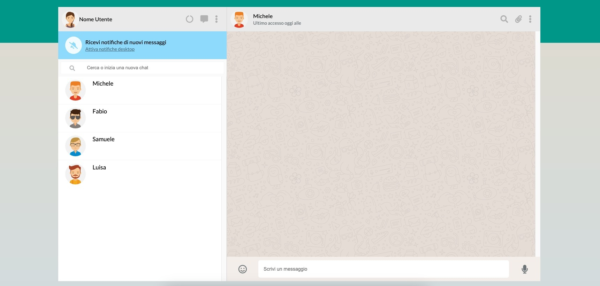

## Milestone 1

Replica della grafica (in allegato) con la possibilità di avere messaggi scritti dall’utente (verdi) e dall’interlocutore (bianco) assegnando due classi CSS diverse. Visualizzazione dinamica della lista contatti: tramite la direttiva v-for, visualizzare nome e immagine di ogni contatto. Gestione della responsività (non indicata nella Milestone) della pagina con la rimozione di elementi superflui o eccessivamente ingombranti per lasciare lo spazio adeguato alle funzioni principali.

## Milestone 2

Il click sul contatto mostra la conversazione del contatto cliccato. Visualizzazione dinamica dei messaggi: tramite la direttiva v-for, vengono visualizzati tutti i messaggi relativi al contatto attivo all’interno del pannello della conversazione.

## Milestone 3

Aggiunta di un messaggio: l’utente può scrivere un testo nella parte bassa e digitando “enter” il testo viene aggiunto al thread sopra, come messaggio verde. Risposta dall’interlocutore: ad ogni inserimento di un messaggio, l’utente riceverà un “ok” come risposta, che apparirà dopo 3 secondi.

## Milestone 4

Ricerca utenti: scrivendo qualcosa nell’input a sinistra, vengono visualizzati solo i contatti il cui nome contiene le lettere inserite (es, Marco, Matteo Martina -> Scrivo “mar” rimangono solo Marco e Martina). Visualizzazione ora e ultimo messaggio inviato/ricevuto nella lista dei contatti.

# Milestone 5 

Cancella messaggio: cliccando sul messaggio appare un menu a tendina che permette di cancellare il messaggio selezionato

## Bonus:

1. L'utente non può inviare un messaggio vuoto o composto solamente da spazi;
2. L'icona in basso a destra (a fianco all'input per scrivere un nuovo messaggio) cambia finché l'utente sta scrivendo: di default si visualizza l'icona del microfono, quando l'input non è vuoto si visualizza l'icona dell'aeroplano. Quando il messaggio è stato inviato e l'input si svuota, si torna a visualizzare il microfono. Il messaggio quindi può anche essere inviato cliccando sull'icona dell'aeroplano;
3. Viene predisposta una lista di emoji da utilizzare al posto della risposta "ok:" quando il pc risponde, anziché scrivere "ok", viene scelta un'emoji random dalla lista e viene usata come testo del messaggio di risposta del pc;
4. Sotto al nome del contatto nella parte in alto a destra, cambia l'indicazione dello stato: viene visualizzato il testo "sta scrivendo..." nel timeout in cui il pc risponde, poi mantenere la scritta "online" per un paio di secondi e infine visualizzare "ultimo accesso alle xx:yy" con l'orario corretto;
5. Viene data la possibilità all'utente di cancellare tutti i messaggi di un contatto o di cancellare l'intera chat con tutti i suoi dati: cliccando sull'icona con i tre pallini in alto a destra, si apre un dropdown menu in cui sono presenti le voci "Elimina messaggi" ed "Elimina chat"; cliccando su di essi si cancellano rispettivamente tutti i messaggi di quel contatto (quindi rimane la conversazione vuota) oppure l'intera chat comprensiva di tutti i dati del contatto oltre che tutti i suoi messaggi (quindi sparisce il contatto anche dalla lista di sinistra);
6. Viene data la possibilità all'utente di aggiungere una nuova conversazione, inserendo in un popup il nome del nuovo contatto, al nuovo contatto viene assegnata un'immagine casuale come avatar;
7. Aggiunta dello scroll in giù in automatico fino al messaggio più recente quando viene aggiunto un nuovo messaggio alla conversazione;
8. Viene visualizzato un messaggio di benvenuto che invita l'utente a selezionare un chat dalla lista per visualizzare i suoi messaggi.